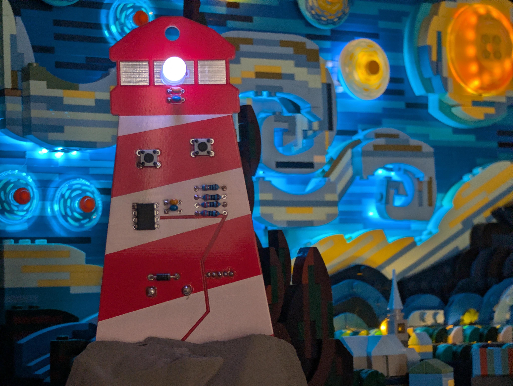

# W3LC0M3 70 7H3 L1GH7H0U53

Navigate your BSides Maine Badge through colors, patterns, and code. Curiosity will be rewarded with the tools you need to succeed.

## Overview

- Play games to unlock hidden areas of the Lighthouse
- Explore details and solve challenges to earn Flags

### Requirements

-   Curiosity
-   Observation
-   Analysis
-   Problem Solving

### Controls

-   Left: Blue / 0
-   Right: Purple / 1
-   Left + Right: Start Puzzle

## Puzzles

-   [71M1NG](B4DG3/PUZZL35/71M1NG.md)
-   [P4773RN5](B4DG3/PUZZL35/P4773RN5.md)
-   [M3M0RY](B4DG3/PUZZL35/M3M0RY.md)
-   [D3741L5](B4DG3/PUZZL35/D3741L5.md)
-   [M47H](B4DG3/PUZZL35/M47H.md)
-   [GR0UND3D](B4DG3/PUZZL35/GR0UND3D.md)
-   [MU51C](B4DG3/PUZZL35/MU51C.md)

